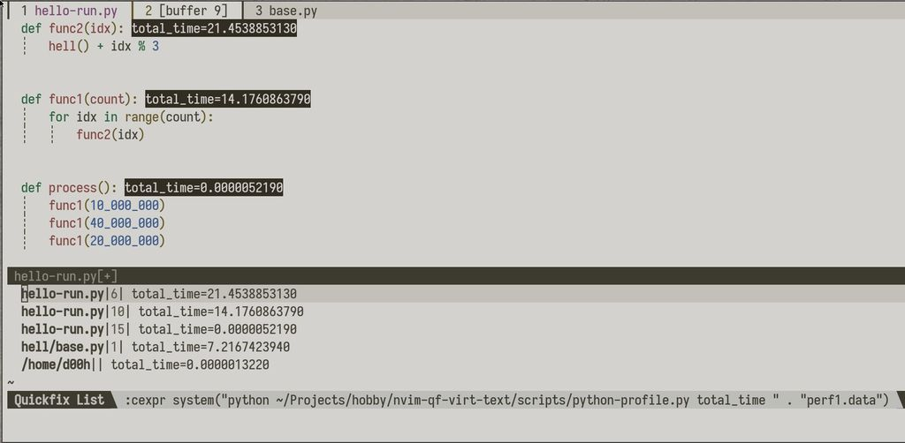

# nvim-highlight-qf

Display QuickFix as VirtualText



# Commands 


```
HighlightQF enable
HighlightQF disable 
HighlightQF toggle 
HighlightQF refresh 
```

# PythonProfile


```vimscript

command -nargs=+ PythonProfile cexpr system("python python-profile.py " . <q-args>)

```
